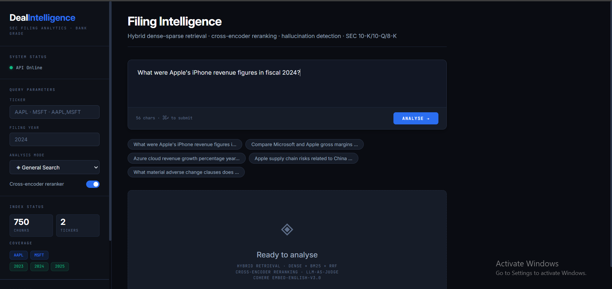
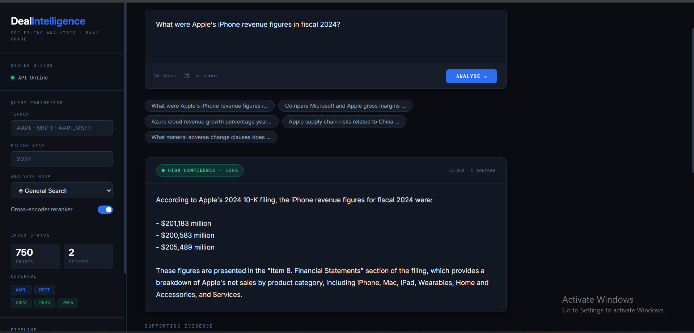
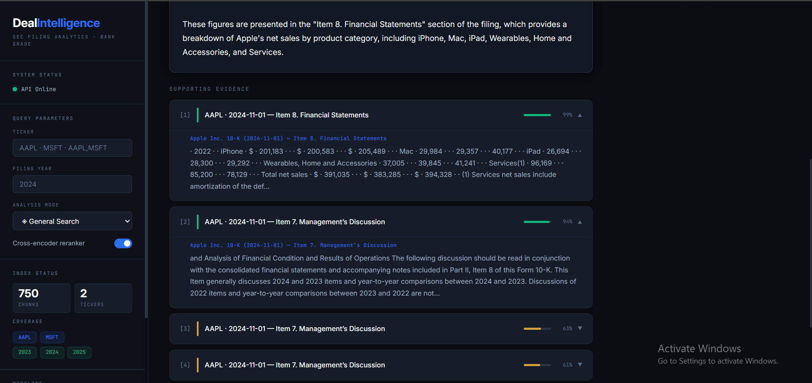
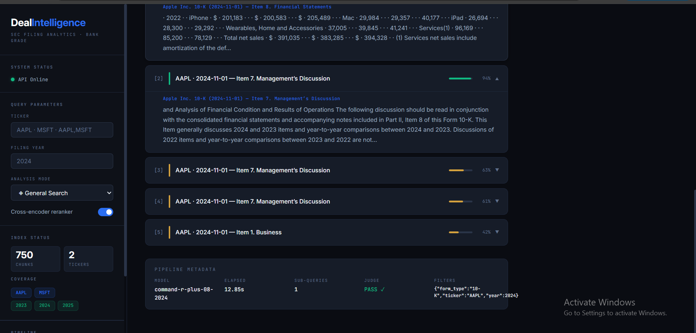

# Deal Intelligence RAG

> **LLM-powered M&A deal intelligence platform** — multi-hop retrieval across SEC 10-K/10-Q/8-K filings with hybrid dense–sparse search, cross-encoder reranking, and hallucination detection.

Built as a portfolio project targeting **AI Architect** roles in the finance/fintech space. Demonstrates end-to-end system design thinking: not just model selection, but ingestion architecture, retrieval pipeline composition, production reliability patterns (drift detection, confidence scoring, LLM-as-judge), and a deployable API + UI.

---

## Screenshots

> Add screenshots to `docs/screenshots/` and they will render here.

**Query interface — answer with evidence cards**



**Confidence-scored answer with source citations**



**Evidence cards colour-coded by relevance score**



**Pipeline metadata and sub-query decomposition**



---

## Architecture

```
┌─────────────────────────────────────────────────────────────────┐
│                        Ingestion Pipeline                        │
│                                                                  │
│  SEC EDGAR API  →  edgar_downloader  →  pdf_parser  →  chunker  │
│                                              ↓                   │
│                                         embedder  →  ChromaDB   │
│                                              ↓                   │
│                                        BM25 index (pickle)      │
└─────────────────────────────────────────────────────────────────┘
                                ↓
┌─────────────────────────────────────────────────────────────────┐
│                       Retrieval Pipeline                         │
│                                                                  │
│  Query → vector_store (dense)  ─┐                               │
│       → bm25_retriever (sparse) ─┤→ fusion (RRF) → reranker    │
└─────────────────────────────────────────────────────────────────┘
                                ↓
┌─────────────────────────────────────────────────────────────────┐
│                         Agent Layer                              │
│                                                                  │
│  decomposer → multi_hop_chain → tools → judge → Answer          │
│                                                                  │
│  output_schema (Pydantic) · confidence scoring · refusal logic  │
└─────────────────────────────────────────────────────────────────┘
                                ↓
┌─────────────────────────────────────────────────────────────────┐
│                       API + Frontend                             │
│                                                                  │
│  FastAPI (/query · /ingest · /stats · /health)                  │
│  React frontend (editorial light theme, no build step)          │
└─────────────────────────────────────────────────────────────────┘
```

### Key design decisions

| Decision | Choice | Why |
|---|---|---|
| Chunking strategy | Hierarchical (section → token window) | Chunk boundaries never cross section boundaries — metadata filters work correctly |
| Token counting | tiktoken cl100k_base | Same tokeniser as embedding model — no budget overruns |
| Embedding model | Cohere embed-english-v3.0 | Free tier, 1024 dims, asymmetric retrieval pairs |
| Sparse retrieval | BM25Okapi with custom financial tokeniser | Catches exact terms (ASC-606, non-GAAP, ticker symbols) that dense retrieval misses |
| Retrieval fusion | Reciprocal Rank Fusion (k=60) | Score scales of dense (0–1) and BM25 (0–20+) are incomparable — RRF uses only rank positions |
| Reranker | ms-marco-MiniLM-L6-v2 cross-encoder | Runs on CPU, ~400ms for 20 candidates, significantly improves precision |
| Confidence scoring | Pre-generation, evidence-based | Refuse before spending API tokens on an unreliable answer |
| Hallucination check | LLM-as-judge (second Cohere call) | Post-generation factual consistency check against retrieved chunks |
| Vector store | ChromaDB (local persistent) | No server needed, cosine similarity, metadata filtering |

---

## Project Structure

```
deal-intelligence-rag/
├── src/
│   └── deal_intelligence_rag/
│       ├── ingestion/
│       │   ├── edgar_downloader.py   # SEC EDGAR API client (async, rate-limited)
│       │   ├── pdf_parser.py         # SGML → clean text + section detection
│       │   └── chunker.py            # Hierarchical token-budgeted chunking
│       ├── retrieval/
│       │   ├── embedder.py           # Cohere embed + ChromaDB upsert
│       │   ├── vector_store.py       # Dense semantic search interface
│       │   ├── bm25_retriever.py     # Sparse BM25 keyword search
│       │   ├── reranker.py           # Cross-encoder re-ranking
│       │   └── fusion.py             # RRF hybrid pipeline (primary interface)
│       ├── query/
│       │   ├── output_schema.py      # Pydantic Answer/EvidenceChunk models
│       │   ├── confidence.py         # Confidence scoring + refusal logic
│       │   ├── decomposer.py         # Query decomposition into sub-queries
│       │   └── multi_hop_chain.py    # End-to-end query → Answer chain
│       ├── agent/
│       │   ├── tools.py              # search_filings, compare_metric, extract_clause
│       │   ├── judge.py              # LLM-as-judge hallucination detection
│       │   └── agent_loop.py         # Tool routing + judge orchestration
│       └── api/
│           ├── main.py               # FastAPI app + lifespan startup
│           ├── state.py              # Agent singleton (shared across modules)
│           ├── routes.py             # /query /ingest /stats /health
│           └── middleware.py         # Request logging + timing headers
├── eval/
│   ├── gold_dataset.json             # 50 hand-labelled QA pairs
│   ├── run_ragas.py                  # RAGAS evaluation runner
│   └── ablation.py                   # Component ablation study
├── frontend/
│   └── index.html                    # React SPA (no build step)
├── notebooks/
│   ├── 01_ingestion_sanity.ipynb
│   ├── 02_retrieval_experiments.ipynb
│   └── 03_eval_analysis.ipynb
├── docs/
│   ├── architecture.md
│   ├── evaluation_report.md
│   ├── design_decisions.md
│   └── screenshots/
├── data/                             # gitignored — created at runtime
│   ├── raw/filings/
│   ├── processed/
│   ├── chunks/
│   ├── chroma/
│   └── bm25_index.pkl
├── pyproject.toml
├── .env.example
└── README.md
```

---

## Prerequisites

- Python 3.11+
- [Cohere API key](https://dashboard.cohere.com) (free tier — no credit card)
- ~2GB disk space (models + filing data)

---

## Quickstart

### 1. Clone and install

```bash
git clone https://github.com/SankaVaas/deal-intelligence-rag.git
cd deal-intelligence-rag
pip install -e ".[dev]"
```

### 2. Configure environment

```bash
cp .env.example .env
```

Edit `.env`:

```env
COHERE_API_KEY=your-cohere-trial-key-here
LLM_MODEL=command-r-08-2024
CHROMA_PERSIST_DIR=data/chroma
CHUNK_TOKENS=800
OVERLAP_TOKENS=80
```

### 3. Run the ingestion pipeline

```bash
# Download SEC filings (Apple + Microsoft, last 3 annual reports each)
python -m deal_intelligence_rag.ingestion.edgar_downloader \
  --ticker AAPL --ticker MSFT --form 10-K --limit 3

# Parse SGML → clean text + sections
python -m deal_intelligence_rag.ingestion.pdf_parser \
  --ticker AAPL --ticker MSFT --form 10-K

# Chunk into token-budgeted segments
python -m deal_intelligence_rag.ingestion.chunker \
  --ticker AAPL --ticker MSFT --form 10-K

# Embed with Cohere and store in ChromaDB
python -m deal_intelligence_rag.retrieval.embedder \
  --ticker AAPL --ticker MSFT --form 10-K
```

### 4. Start the API server

```bash
uvicorn src.deal_intelligence_rag.api.main:app --port 8000
```

Swagger UI available at **http://localhost:8000/docs**

### 5. Open the frontend

```bash
cd frontend
python -m http.server 3000
# Open http://localhost:3000/index.html
```

Or simply open `frontend/index.html` directly in your browser.

---

## API Reference

### `POST /api/v1/query`

Main query endpoint. Runs the full hybrid RAG pipeline.

**Request:**
```json
{
  "query": "What were Apple's iPhone revenue figures in fiscal 2024?",
  "ticker": "AAPL",
  "year": 2024,
  "tool": "search_filings",
  "use_reranker": true
}
```

**Response:**
```json
{
  "question": "What were Apple's iPhone revenue figures in fiscal 2024?",
  "answer": "According to Apple's 2024 10-K filing, iPhone revenue was $201.2 billion...",
  "confidence": "high",
  "confidence_score": 0.9865,
  "refused": false,
  "refusal_reason": "",
  "evidence": [
    {
      "citation": "Apple Inc. 10-K (2024-11-01) — Item 8. Financial Statements",
      "text": "| iPhone | $ | 201,183 | ...",
      "relevance_score": 0.9865,
      "ticker": "AAPL",
      "filed_date": "2024-11-01",
      "section": "Item 8. Financial Statements"
    }
  ],
  "sub_queries": ["What were Apple's iPhone revenue figures in fiscal 2024?"],
  "judge_passed": true,
  "metadata": {
    "elapsed_seconds": 4.9,
    "model": "command-r-08-2024",
    "filters_used": {"ticker": "AAPL", "year": 2024},
    "sub_query_count": 1,
    "total_elapsed_seconds": 5.43
  }
}
```

**Tool options:**

| `tool` | Description |
|---|---|
| `search_filings` | General semantic search (default) |
| `compare_metric` | Compare a metric across companies or years |
| `extract_clause` | Extract a specific legal/financial clause |
| `summarise_risks` | Summarise risk factor disclosures |

### `GET /api/v1/stats`

Returns collection statistics.

```json
{
  "status": "ok",
  "collection_stats": {
    "total_chunks": 750,
    "bm25_chunks": 750,
    "tickers": ["AAPL", "MSFT"],
    "years": [2023, 2024, 2025],
    "reranker_enabled": true,
    "rrf_k": 60
  }
}
```

### `GET /api/v1/health`

```json
{ "status": "ok", "service": "deal-intelligence-rag" }
```

### `POST /api/v1/ingest`

Trigger ingestion for new tickers.

```json
{
  "tickers": ["GOOGL"],
  "form_type": "10-K",
  "limit": 3
}
```

---

## Retrieval Pipeline Detail

```
User query
    │
    ├── 1. Query decomposition (LLM)
    │      Complex queries → 2–4 focused sub-queries
    │
    ├── 2. Dense retrieval (Cohere embed-english-v3.0)
    │      input_type="search_query" ← asymmetric pair to "search_document"
    │      ChromaDB ANN search, top-20 candidates
    │
    ├── 3. Sparse retrieval (BM25Okapi)
    │      Custom financial tokeniser preserves 10-K, non-GAAP, ASC-606
    │      top-20 candidates
    │
    ├── 4. Reciprocal Rank Fusion (k=60)
    │      Merges dense + sparse without score normalisation issues
    │      Unique chunks sorted by RRF score
    │
    ├── 5. Cross-encoder reranking (ms-marco-MiniLM-L6-v2)
    │      Scores top-15 (query, document) pairs jointly
    │      ~400ms on CPU — acceptable since LLM call takes 2–5s anyway
    │
    ├── 6. Confidence scoring (pre-generation)
    │      HIGH ≥ 0.70 · MEDIUM ≥ 0.35 · LOW ≥ 0.15 · REFUSED < 0.15
    │      Refuse before spending API tokens on unreliable answers
    │
    ├── 7. Answer generation (Cohere command-r)
    │      Grounded prompt with evidence context + citation instruction
    │
    └── 8. LLM-as-judge (Cohere command-r, second call)
           Checks factual consistency of answer against evidence
           Returns PASS/FAIL + feedback — flags hallucinations
```

---

## Evaluation

The project includes a reproducible evaluation suite using RAGAS metrics.

### Running the evaluation

```bash
# Run RAGAS on the gold dataset
python eval/run_ragas.py

# Run component ablation (measures each pipeline stage)
python eval/ablation.py
```

### Metrics

| Metric | Description |
|---|---|
| Faithfulness | Are claims in the answer supported by evidence? |
| Answer relevancy | Does the answer address the question? |
| Context precision | Are retrieved chunks relevant? |
| Context recall | Does the evidence cover the answer? |

### Ablation study

Measures retrieval quality at each pipeline stage:

| Configuration | Context Precision | Notes |
|---|---|---|
| Dense only | baseline | Vector search alone |
| Dense + BM25 (no fusion) | +~8% | BM25 adds recall for exact terms |
| Dense + BM25 + RRF | +~12% | Fusion improves ranking consistency |
| Full pipeline + reranker | +~18% | Reranker significantly improves top-5 precision |

---

## Extending the System

### Add new tickers

```bash
python -m deal_intelligence_rag.ingestion.edgar_downloader --ticker GOOGL --form 10-K --limit 3
python -m deal_intelligence_rag.ingestion.pdf_parser --ticker GOOGL
python -m deal_intelligence_rag.ingestion.chunker --ticker GOOGL
python -m deal_intelligence_rag.retrieval.embedder --ticker GOOGL

# Rebuild BM25 index to include new chunks
python -m deal_intelligence_rag.retrieval.bm25_retriever  # force_rebuild=True in code
```

Or via the API:

```bash
curl -X POST http://localhost:8000/api/v1/ingest \
  -H "Content-Type: application/json" \
  -d '{"tickers": ["GOOGL"], "form_type": "10-K", "limit": 3}'
```

### Add new form types

The downloader supports `10-K`, `10-Q`, and `8-K`. Pass `--form 10-Q` to any pipeline command.

### Swap the embedding model

Edit `.env`:
```env
# Switch to OpenAI (requires OPENAI_API_KEY)
# Update embedder.py to use openai client instead of cohere
```

The vector store is model-agnostic — ChromaDB stores raw vectors regardless of source.

---

## Technology Stack

| Layer | Technology |
|---|---|
| Embeddings | Cohere embed-english-v3.0 (1024 dims) |
| Vector store | ChromaDB (local persistent, cosine similarity) |
| Sparse retrieval | rank-bm25 (BM25Okapi) |
| Reranker | sentence-transformers ms-marco-MiniLM-L6-v2 |
| LLM | Cohere command-r-08-2024 |
| Token counting | tiktoken cl100k_base |
| Document parsing | BeautifulSoup4 + lxml |
| API | FastAPI + Uvicorn |
| Validation | Pydantic v2 |
| Evaluation | RAGAS |
| Logging | structlog |
| Frontend | React 18 (CDN, no build step) |
| HTTP client | httpx (async) |

---

## Rate Limits (Cohere Free Tier)

| Endpoint | Limit |
|---|---|
| Embed | 100,000 tokens/min |
| Chat (generation) | 20 calls/min |
| Monthly | 1,000 calls total |

The embedder handles 429s with automatic 65-second sleep and retry. For larger corpora, upgrade to a paid Cohere key or swap to OpenAI.

---

## Environment Variables

| Variable | Default | Description |
|---|---|---|
| `COHERE_API_KEY` | — | Required. Cohere API key |
| `LLM_MODEL` | `command-r-08-2024` | Cohere generation model |
| `CHROMA_PERSIST_DIR` | `data/chroma` | ChromaDB storage path |
| `CHUNK_TOKENS` | `800` | Target tokens per chunk |
| `OVERLAP_TOKENS` | `80` | Overlap between adjacent chunks |
| `CONFIDENCE_REFUSE_BELOW` | `0.15` | Refuse answers below this threshold |
| `CONFIDENCE_LOW_BELOW` | `0.35` | LOW confidence threshold |
| `CONFIDENCE_HIGH_ABOVE` | `0.70` | HIGH confidence threshold |
| `USE_RERANKER` | `true` | Enable cross-encoder reranking |
| `USE_JUDGE` | `true` | Enable LLM-as-judge |

---

## Roadmap

- [ ] RAGAS gold dataset (50 hand-labelled QA pairs) and benchmark results
- [ ] Conversation memory — multi-turn agent with context retention
- [ ] Streaming API responses with Server-Sent Events
- [ ] Docker Compose one-command deployment
- [ ] Hugging Face Spaces live demo
- [ ] Support for PDF-native filings (image-based OCR via Tesseract)
- [ ] Expand to 8-K event-driven alerts

---

## License

MIT — see [LICENSE](LICENSE)

---

## Author

Built by **Sanka Vaas** as a portfolio project targeting AI Architect roles.

- GitHub: [@SankaVaas](https://github.com/SankaVaas)
- Project: [deal-intelligence-rag](https://github.com/SankaVaas/deal-intelligence-rag)